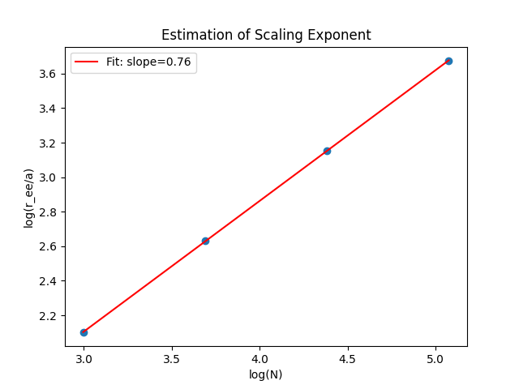

# Thermodynamic Analysis of a 2D HP Lattice Polymer

This project implements a numerical study of the 2D HP (hydrophobic–polar) lattice polymer model using scaling analysis and exact density-of-states thermodynamics.

The goal is to connect polymer geometry with canonical ensemble thermodynamics.

---

## Model

The HP model represents a polymer as a self-avoiding walk on a 2D square lattice.  
Each monomer is hydrophobic (H) or polar (P). Only non-bonded nearest-neighbor H–H contacts contribute to the energy:

E = -ε N_HH

All thermodynamic quantities are computed in the canonical ensemble (with k = ε = 1).

---

## Part I — Scaling of Self-Avoiding Walks

At high temperature, the chain behaves as a self-avoiding walk with scaling:

R_ee ∝ N^ν

Using log–log regression of the provided data, the exponent was obtained as:

ν = 0.7569 ± 0.0025

This is consistent with the expected 2D self-avoiding walk value (ν ≈ 0.75).

Generated output:



---

## Part II — Thermodynamics from the Density of States

Using the exact density of states g(E) for a 27-bead HP chain, thermodynamic averages are computed via:

⟨f⟩_T = (Σ_E f(E) g(E) e^(−E/T)) / (Σ_E g(E) e^(−E/T))

A shifted Boltzmann factor e^(−(E − E_min)/T) is used for numerical stability.

### Heat Capacity

C_V = (1 / T²) (⟨E²⟩ − ⟨E⟩²)

The heat capacity exhibits a maximum at:

T_max ≈ 0.42

This marks the folding–unfolding crossover.

Generated output:


### Native-State Probability

P_nat(T) = 1 / (Σ_E g(E) e^(−(E − E_min)/T))

The rapid decrease of the ground-state probability occurs near the heat-capacity peak, reflecting maximal energy fluctuations.

Generated output:


---

## How to Run

```bash
python main.py
```

Dependencies:
- numpy
- matplotlib
- scipy

---

## Future Work

Planned extension: Monte Carlo sampling and comparison with exact density-of-states results.
